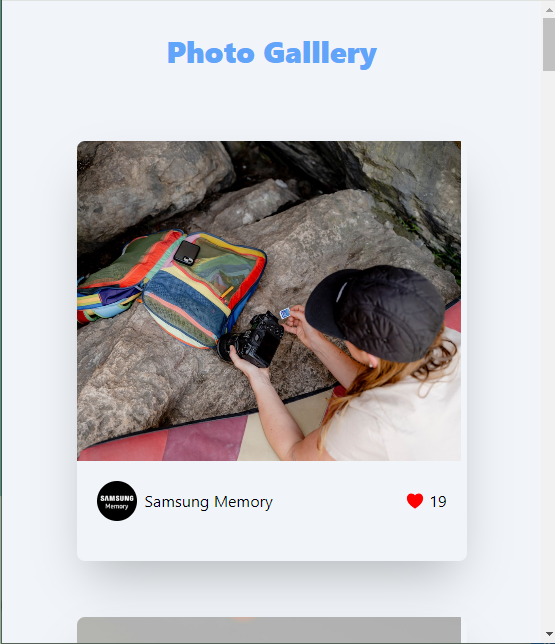
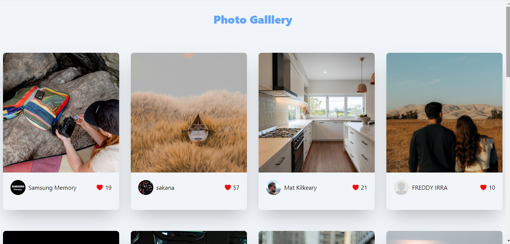

# Photo Gallery with Unsplash API

## Overview

This project is part of the Codevixens 10 Days of Frontend Challenge (Day 9). This photo gallery web application was built using Vite React. The task focuses on mastering API integration (Unsplash API) and creating a simple user interface in ReactJS.

## Features

- **API Integration:** Sign up on Unsplash to get your API key. The API key is used to fetch photos.
- **State Management:** React's **useState** and **useEffect** hooks were used to manage fetched photos, load state, and potential errors.
- **User Interface:** The fetched photos were displayed in a grid layout. Each card contains the image, photographer's picture, photographer's name, and number of likes for the photo.
- **Error Handling:** This was done to provide appropriate feedback when API calls fail.

## Installation

1. Clone the repository: ```javascript git clone https://github.com/Nkwor-Jane/image_gallery.git```

2. Navigate to the project directory: ```javascript cd image_gallery```

3. Install dependencies:```javascript npm install```

## Usage

1. Start the development server: ```javascript npm run dev```

2. Open your browser and navigate to: ```javascript http://localhost:5173/```

## How it Works

The PhotoGallery component is the main React component. It handles the following:

1. **API Integration:** Used [Axios](https://axios-http.com/docs/intro) to make fetch requests from the Unsplash API.

2. **State Management:** Manages the fetched photos, loading state, and potential errors using useState and useEffect hooks.

3. **Rendering UI:** Renders the fetched photos in a grid layout, with mobile responsiveness. The UI was styled using [TailwindCSS](https://tailwindcss.com/docs).

## Screenshots

- Desktop View
  


- Mobile View



## Live Demo

Check out the live demo [here](https://image-gallery-two-lemon.vercel.app/).

## Key Concepts

1. **API Integration:** Interacting with external APIs to fetch data.
2. **State Management:** Managing the state of the React application.
3. **User Interface:** Creating responsive layout.

## Contirbuting

Feel free to clone and fork this repository. You can also submit pull requests. Any contributions are welcome!

## License

This project is licensed under the MIT License

## Acknowledgements

- [Codevixens](https://codevixens.org/) for organizing this challenge.
- Lois Bassey, Chinaza Igboanugo, Gaelle Tiku Brenda - and Oyakinsola Shoroye for their contributions and guidance towards the successful completion of this project.

Feel free to customize it further to fit your needs! If you have any specific details you'd like to add or change, let me know.
